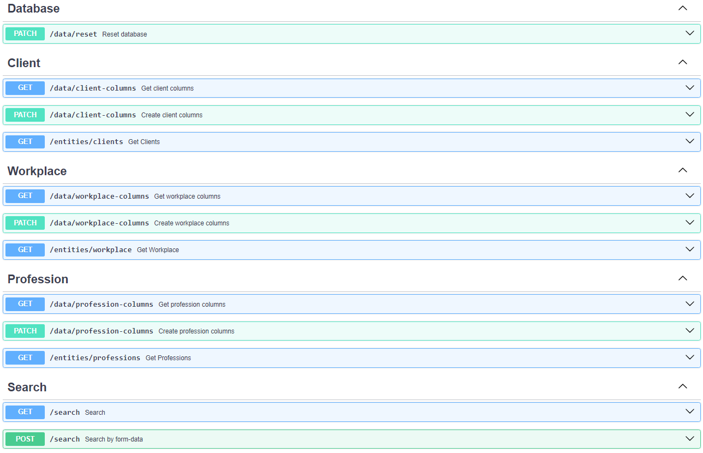

# Setup
```
docker compose up 
```
 OR
```
docker compose up -d 
```
For `Detached mode`.

# Overview

 Cache Proxy is a project as a smart cache layer designed to enhance the interaction between a JSON API and users. One of the standout features is the ability for users to dynamically generate their own data structures based on the information they receive. This unique functionality allows for a highly customizable and adaptable approach to data handling within the application.

# Documentation

<table>
    <tr>
        <th>Tag</th>
        <th>Method</th>
        <th>Path</th>
        <th>Overview</th>
        <th>Description</th>
    </tr>
    <tr>
        <td><b>Database</b></td>
        <td><b>PATCH</b></td>
        <td><b>/data/reset</b></td>
        <td>Reset database</td>
        <td>Overwrites the database from BASE_URL (by default) or from the input file.</td>
    </tr>
    <tr>
        <td><b>Client</b></td>
        <td><b>GET</b></td>
        <td><b>/data/client-columns</b></td>
        <td>Get client columns</td>
        <td>Returns the client columns that are <u>currently</u> relevant for client representation.</td>
    </tr>
    <tr>
        <td><b>Client</b></td>
        <td><b>PATCH</b></td>
        <td><b>/data/client-columns</b></td>
        <td>Reset client columns</td>
        <td>Reset the client columns that should be <u>currently</u> relevant for client representation.</td>
    </tr>
    <tr>
        <td><b>Client</b></td>
        <td><b>GET</b></td>
        <td><b>/entities/clients</b></td>
        <td>Return clients</td>
        <td>Returns clients that have <u>current</u> fields from <b>data/client-columns</b></td>
    </tr>
    <tr>
        <td><b>Workplace</b></td>
        <td><b>GET</b></td>
        <td><b>/data/workplace-columns</b></td>
        <td>Get workplace columns</td>
        <td>Returns the workplace columns that are <u>currently</u> relevant for workplace representation.</td>
    </tr>
    <tr>
        <td><b>Workplace</b></td>
        <td><b>PATCH</b></td>
        <td><b>/data/workplace-columns</b></td>
        <td>Reset workplace columns</td>
        <td>Reset the workplace columns that should be <u>currently</u> relevant for workplace representation.</td>
    </tr>
    <tr>
        <td><b>Workplace</b></td>
        <td><b>GET</b></td>
        <td><b>/entities/workplace</b></td>
        <td>Return workplaces</td>
        <td>Returns workplaces that have <u>current</u> fields from <b>data/workplace-columns</b></td>
    </tr>
    <tr>
        <td><b>Profession</b></td>
        <td><b>GET</b></td>
        <td><b>/data/profession-columns</b></td>
        <td>Get profession columns</td>
        <td>Returns the profession columns that are <u>currently</u> relevant for profession representation.</td>
    </tr>
    <tr>
        <td><b>Profession</b></td>
        <td><b>PATCH</b></td>
        <td><b>/data/profession-columns</b></td>
        <td>Reset profession columns</td>
        <td>Reset the profession columns that should be <u>currently</u> relevant for profession representation.</td>
    </tr>
    <tr>
        <td><b>Profession</b></td>
        <td><b>GET</b></td>
        <td><b>/entities/professions</b></td>
        <td>Return professions</td>
        <td>Returns professions that have <u>current</u> fields from <b>data/profession-columns</b></td>
    </tr>
    <tr>
        <td><b>Search</b></td>
        <td><b>GET</b></td>
        <td><b>/search</b></td>
        <td>Return search result by query</td>
        <td>Simple search, the search string is passed through the GET request parameters</b></td>
    </tr>
    <tr>
        <td><b>Search</b></td>
        <td><b>POST</b></td>
        <td><b>/search</b></td>
        <td>Return search result by query, clientid, palaceid, profid</td>
        <td>Parameterized search via POST request. Form-data can be passed as parameters: clientid, placed, profit, searchstring. If the client id and/or placeid and/or profit are filled in, then the search is performed taking into account the filter.</b></td>
    </tr>
</table>


